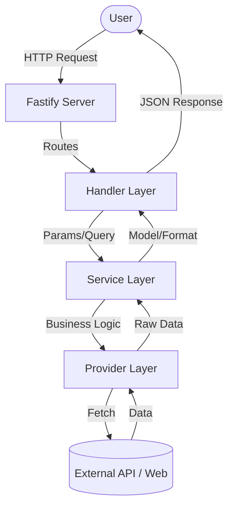

# Architecture Design

## Overview

Vortex is built using a **Feature-Based Plugin Architecture** with **Vertical Slices**. This design ensures that each platform integration (LeetCode, Codeforces, etc.) is self-contained, highly modular, and easy to maintain.

## Modular Structure

Each platform and the AI interface is implemented as a Fastify plugin located in `src/modules/{module_name}/`. This allows for:
- **Isolation**: Changes in one platform don't affect others.
- **Scalability**: Easy to add or remove platforms.
- **Consistency**: Every module follows the same structure and design patterns.
- **AI Integration**: Dedicated MCP module for real-time tool access for AI agents.

## Vertical Slices

Unlike traditional horizontal layering (where all controllers are in one folder, all services in another), we use vertical slices. All code related to a specific feature (like LeetCode) lives in one directory.

### Layered Responsibilities

Inside each module, we follow a strict layering pattern:

1.  **Plugin Entry (`index.ts`)**: Exports the Fastify plugin.
2.  **Routes (`routes.ts`)**: Defines endpoints, registers schemas, and assigns handlers.
3.  **Handlers (`handlers/`)**: Extracts data from requests (params, query, body), calls services, and sends responses.
4.  **Services (`services/`)**: Orchestrates business logic. Pure TypeScript, no Fastify dependencies.
5.  **Provider (`provider.ts`)**: Handles external communication (HTTP, GraphQL, Scraping).
6.  **Schemas (`schemas.ts`)**: JSON schemas for request/response validation (also used for Swagger).
7.  **Types (`types.ts`)**: TypeScript interfaces for data structures.
 
 ### MCP Module Structure
 
 The `src/modules/mcp/` module follows a slightly different structure to support the Model Context Protocol:
 - **`tools/`**: Implementation of AI-callable tools.
 - **`prompts/`**: Pre-defined prompts for LLM guidance.
 - **`resources/`**: Static or dynamic data resources exposed to agents.
 - **`index.ts`**: Plugin registration using `fastify-mcp`.

## Data Flow

## Shared Infrastructure

-   **`src/shared/`**: Common utilities, midlewares, and HTTP clients used across modules.
-   **`src/config/`**: Environment variable management using `fastify-env`.
-   **`src/types/`**: Global type definitions and Fastify type augmentation.

## Performance & Validation

-   **JSON Schema**: Every route uses high-performance JSON schema validation.
-   **Serialization**: Fastify uses `fast-json-stringify` for lightning-fast responses based on our schemas.
-   **TypeScript**: Full end-to-end type safety from provider to handler.
