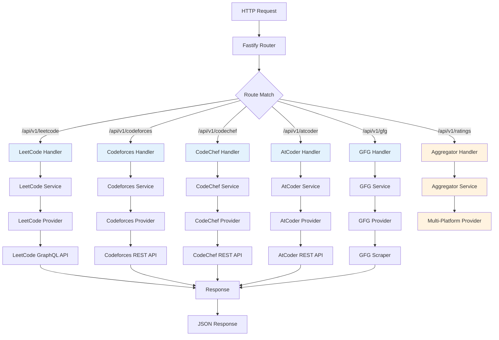

# Vortex

A high-speed, vertical-slice aggregator for competitive programming metrics. Vortex unifies data from LeetCode, Codeforces, CodeChef, AtCoder, and GeeksforGeeks into a single, modular API layer. Built for modern web applications and AI agents via the **Model Context Protocol (MCP)**.

---

## Architecture

Vortex follows a **strict vertical slice architecture**. Each competitive programming platform is an isolated, self-contained plugin that flows through a consistent request pipeline.

### Vortex Flow Diagram



### Vertical Slice Philosophy

Each platform module (`src/modules/{platform}/`) is a **complete vertical slice**:

| Layer | Responsibility | Dependencies |
|-------|---------------|--------------|
| **routes.ts** | Fastify plugin registration, OpenAPI schemas, endpoint definitions | None (Entry Point) |
| **handlers.ts** | HTTP request/response handling, parameter extraction, validation | Service layer |
| **service.ts** | Business logic, data transformation, error handling | Provider layer |
| **provider.ts** | External API integration, HTTP client configuration | External APIs only |
| **types.ts** | TypeScript interfaces for domain models | None |
| **schemas.ts** | JSON Schema for request/response validation | None |

**Key Constraint:** Each layer can only depend on layers below it. No cross-module dependencies are allowed except through the aggregator service.

---

## Project Structure

```
src/
├── app.ts                      # Fastify app configuration & plugin registration
├── server.ts                   # HTTP server bootstrap
├── config/
│   └── env.ts                  # Environment variable validation
├── shared/
│   ├── middlewares/
│   │   └── validate.ts         # Global validation middleware
│   └── utils/
│       ├── http-client.ts      # Axios instance with timeout & retry
│       └── timeout.ts          # Request timeout utilities
├── types/
│   ├── api.ts                  # Common API response types
│   └── fastify.ts              # Fastify type augmentation
└── modules/
    ├── leetcode/               # LeetCode vertical slice
    ├── codeforces/             # Codeforces vertical slice
    ├── codechef/               # CodeChef vertical slice
    ├── atcoder/                # AtCoder vertical slice
    ├── gfg/                    # GeeksforGeeks vertical slice
    ├── ratings/                # Cross-platform aggregator
    └── mcp/                    # Model Context Protocol server
```

---

## Installation

### Prerequisites

- **Node.js** 18+ (LTS recommended)
- **pnpm** 8+ (install via `npm i -g pnpm`)

### Setup

```bash
# Clone repository
git clone https://github.com/Anujjoshi3105/vortex.git
cd vortex

# Install dependencies
pnpm install

# Configure environment
cp .env.example .env
# Edit .env with your configuration
```

#### `.env.example`

```env
# Server Configuration
PORT=3000
HOST=0.0.0.0
NODE_ENV=development

# Security (optional)
AUTH_SECRET=your_auth_secret_here
```

### Development

```bash
# Start dev server with hot-reload
pnpm dev
```

Server starts at `http://localhost:3000`

API documentation: `http://localhost:3000/docs`

### Production Build

```bash
# Compile TypeScript
pnpm build

# Start production server
pnpm start
```

### MCP Inspector (AI Tool Testing)

```bash
# Launch MCP Inspector UI
pnpm inspect
```

Opens at `http://localhost:6274` for interactive MCP tool testing.

---

## API Reference

### Platform-Specific Endpoints

| Platform | Endpoint | Description |
|----------|----------|-------------|
| **LeetCode** | `GET /api/v1/leetcode/rating?username={user}` | User contest rating & ranking |
| | `GET /api/v1/leetcode/contest-ranking?username={user}` | Contest participation history |
| | `GET /api/v1/leetcode/daily-problem` | Today's daily challenge |
| | `GET /api/v1/leetcode/contests` | Upcoming contests |
| **Codeforces** | `GET /api/v1/codeforces/rating?username={user}` | Current rating & rank |
| | `GET /api/v1/codeforces/contest-history?username={user}` | Rating change graph |
| | `GET /api/v1/codeforces/status?username={user}&from=1&count=10` | Recent submissions |
| | `GET /api/v1/codeforces/solved-problems?username={user}` | Unique solved problems |
| **CodeChef** | `GET /api/v1/codechef/rating?username={user}` | Current rating & stars |
| **AtCoder** | `GET /api/v1/atcoder/rating?username={user}` | Current rating & color |
| **GeeksforGeeks** | `GET /api/v1/gfg/rating?username={user}` | Overall score & rank |

### Aggregator Endpoint

```http
GET /api/v1/ratings?username={user}
```

Returns unified ratings from **all platforms** in a single response:

```json
{
  "username": "tourist",
  "platforms": {
    "leetcode": { "rating": 3200, "rank": "Knight", ... },
    "codeforces": { "rating": 3821, "rank": "Legendary Grandmaster", ... },
    "codechef": { "rating": 2800, "stars": "7★", ... },
    "atcoder": { "rating": 3817, "color": "red", ... },
    "gfg": { "score": 9500, "rank": 1, ... }
  }
}
```

### Health Check

```http
GET /health
```

Returns `{ "status": "ok" }` for uptime monitoring.

---

## Model Context Protocol (MCP)

Vortex exposes its functionality as **MCP tools** for AI agents (e.g., Claude Desktop, LangChain agents).

### Connecting to Claude Desktop

Add to your `claude_desktop_config.json`:

```json
{
  "mcpServers": {
    "vortex-cp": {
      "command": "node",
      "args": [
        "path/to/vortex/dist/server.js"
      ],
      "env": {
        "PORT": "3000"
      }
    }
  }
}
```

Restart Claude Desktop.

### MCP Endpoints (HTTP/SSE)

- **SSE Transport**: `GET /mcp/sse`
- **Message Handler**: `POST /mcp/messages?sessionId={id}`

Use the MCP Inspector (`pnpm inspect`) to test tools interactively before integrating with agents.

---

## Contributors Guide

### Adding a New Platform

To maintain **vertical slice integrity**, follow this checklist when adding a new platform (e.g., HackerRank):

#### 1. Create Module Directory

```bash
mkdir -p src/modules/hackerrank
cd src/modules/hackerrank
touch index.ts routes.ts handlers.ts service.ts provider.ts types.ts schemas.ts
```

#### 2. Define Types (`types.ts`)

```typescript
export interface HackerRankRating {
  username: string;
  rating: number;
  rank: string;
  solvedCount: number;
}
```

#### 3. Implement Provider (`provider.ts`)

**Responsibility:** External API integration only. No business logic.

```typescript
import axios from 'axios';
import { HackerRankRating } from './types';

export async function fetchUserRating(username: string): Promise<HackerRankRating> {
  const { data } = await axios.get(`https://api.hackerrank.com/users/${username}`);
  return {
    username: data.username,
    rating: data.rating,
    rank: data.rank,
    solvedCount: data.challenges_solved
  };
}
```

#### 4. Implement Service (`service.ts`)

**Responsibility:** Business logic, data transformation, error handling.

```typescript
import * as provider from './provider';
import { HackerRankRating } from './types';

export async function getUserRating(username: string): Promise<HackerRankRating> {
  if (!username || username.length < 3) {
    throw new Error('Invalid username');
  }
  
  const data = await provider.fetchUserRating(username);
  
  // Apply business rules (e.g., normalize rank)
  return {
    ...data,
    rank: data.rank.toUpperCase()
  };
}
```

#### 5. Implement Handlers (`handlers.ts`)

**Responsibility:** HTTP request/response handling, parameter extraction.

```typescript
import { FastifyRequest, FastifyReply } from 'fastify';
import * as service from './service';

interface RatingQuery {
  username: string;
}

export async function getUserRatingHandler(
  request: FastifyRequest<{ Querystring: RatingQuery }>,
  reply: FastifyReply
) {
  const { username } = request.query;
  
  try {
    const data = await service.getUserRating(username);
    reply.send({ success: true, data });
  } catch (error) {
    reply.status(500).send({ success: false, error: error.message });
  }
}
```

#### 6. Define Schemas (`schemas.ts`)

**Responsibility:** OpenAPI/JSON Schema for validation and documentation.

```typescript
export const ratingQuerySchema = {
  type: 'object',
  required: ['username'],
  properties: {
    username: { type: 'string', minLength: 3 }
  }
};

export const ratingResponseSchema = {
  type: 'object',
  properties: {
    success: { type: 'boolean' },
    data: {
      type: 'object',
      properties: {
        username: { type: 'string' },
        rating: { type: 'number' },
        rank: { type: 'string' },
        solvedCount: { type: 'number' }
      }
    }
  }
};
```

#### 7. Create Routes Plugin (`routes.ts`)

**Responsibility:** Fastify plugin registration, OpenAPI tags.

```typescript
import { FastifyPluginAsync } from 'fastify';
import * as handlers from './handlers';
import * as schemas from './schemas';

export const hackerrankPlugin: FastifyPluginAsync = async (fastify) => {
  fastify.get('/rating', {
    schema: {
      tags: ['HackerRank'],
      description: 'Get HackerRank user rating',
      querystring: schemas.ratingQuerySchema,
      response: { 200: schemas.ratingResponseSchema }
    }
  }, handlers.getUserRatingHandler);
};

export default hackerrankPlugin;
```

#### 8. Barrel Export (`index.ts`)

```typescript
export { hackerrankPlugin } from './routes';
export * from './types';
```

#### 9. Register in App (`src/app.ts`)

```typescript
import { hackerrankPlugin } from './modules/hackerrank';

// Inside buildApp()
await fastify.register(hackerrankPlugin, { prefix: '/api/v1/hackerrank' });
```

#### 10. Update OpenAPI Tags (`src/app.ts`)

```typescript
tags: [
  // ... existing tags
  { name: 'HackerRank', description: 'HackerRank platform integration' }
]
```

**Result:** Your new platform is now a self-contained vertical slice with zero coupling to other modules.

---

## System Auditor Review: Future Resilience Checklist

The following improvements are recommended for production-grade deployments at scale.

### Resiliency

| Feature | Status | Priority | Effort |
|---------|--------|----------|--------|
| **Circuit Breaker** | ❌ Not Implemented | High | Medium |
| └─ Prevent cascading failures when external APIs are down | | | |
| └─ Recommended: [opossum](https://www.npmjs.com/package/opossum) | | | |
| **Retry Logic** | ⚠️ Partial (Axios defaults) | Medium | Low |
| └─ Exponential backoff for transient failures | | | |
| └─ Recommended: [axios-retry](https://www.npmjs.com/package/axios-retry) | | | |
| **Fallback Responses** | ❌ Not Implemented | Medium | Low |
| └─ Return cached/stale data when APIs are unreachable | | | |

### Performance

| Feature | Status | Priority | Effort |
|---------|--------|----------|--------|
| **Redis Caching** | ❌ Not Implemented | High | Medium |
| └─ Cache platform APIs (TTL: 5-15 minutes) | | | |
| └─ Recommended: [@fastify/redis](https://github.com/fastify/fastify-redis) | | | |
| **Response Compression** | ❌ Not Implemented | Medium | Low |
| └─ Compress JSON responses > 1KB | | | |
| └─ Recommended: [@fastify/compress](https://github.com/fastify/fastify-compress) | | | |
| **Request Timeouts** | ✅ Implemented | - | - |
| └─ Per-provider timeout configuration exists | | | |

### Security

| Feature | Status | Priority | Effort |
|---------|--------|----------|--------|
| **Rate Limiting** | ❌ Not Implemented | High | Low |
| └─ Prevent abuse (e.g., 100 req/min per IP) | | | |
| └─ Recommended: [@fastify/rate-limit](https://github.com/fastify/fastify-rate-limit) | | | |
| **API Key Middleware** | ⚠️ Partial (AUTH_SECRET unused) | Medium | Low |
| └─ Optional authentication for public deployments | | | |
| **Input Sanitization** | ✅ Implemented | - | - |
| └─ JSON Schema validation active on all endpoints | | | |
| **CORS Restrictions** | ⚠️ Too Permissive | Medium | Low |
| └─ Currently allows `origin: '*'` - restrict in production | | | |

### Observability

| Feature | Status | Priority | Effort |
|---------|--------|----------|--------|
| **Structured Logging** | ⚠️ Basic (Fastify Logger) | High | Medium |
| └─ Migrate to [Pino](https://github.com/pinojs/pino) with JSON output | | | |
| └─ Add request IDs, trace context | | | |
| **OpenTelemetry** | ❌ Not Implemented | Medium | High |
| └─ Distributed tracing for multi-provider requests | | | |
| └─ Recommended: [@opentelemetry/auto-instrumentations-node](https://www.npmjs.com/package/@opentelemetry/auto-instrumentations-node) | | | |
| **Metrics Endpoint** | ❌ Not Implemented | Medium | Medium |
| └─ Expose Prometheus metrics (`/metrics`) | | | |
| └─ Track: request latency, error rates, cache hit rates | | | |

### Implementation Roadmap

**Phase 1: Resiliency** (Sprint 1-2)
1. Add circuit breaker pattern to all providers
2. Implement Redis caching layer
3. Add rate limiting middleware

**Phase 2: Security** (Sprint 3)
1. Restrict CORS to whitelisted origins
2. Implement API key authentication (optional)
3. Add request/response sanitization audit

**Phase 3: Observability** (Sprint 4-5)
1. Migrate to Pino structured logging
2. Add OpenTelemetry instrumentation
3. Create Prometheus metrics endpoint
4. Build Grafana dashboards

---

## Testing

### Manual Testing

```bash
# Test single platform
curl "http://localhost:7860/api/v1/leetcode/rating?username=tourist"

# Test aggregator
curl "http://localhost:7860/api/v1/ratings?username=tourist"
```

### MCP Tool Testing

```bash
# Launch MCP Inspector
pnpm inspect

# Test in MCP Inspector UI at http://localhost:6274
# Select tool: get_leetcode_user_rating
# Input: { "username": "tourist" }
```

---

## Technology Stack

| Category | Package | Purpose |
|----------|---------|---------|
| **Runtime** | Node.js 18+ | JavaScript runtime |
| **Framework** | Fastify 5.x | High-performance HTTP server |
| **Language** | TypeScript 5.x | Type-safe development |
| **HTTP Client** | Axios 1.x | External API requests |
| **Validation** | Zod 4.x | Runtime type validation |
| **Scraping** | Cheerio 1.x | HTML parsing (GFG) |
| **Documentation** | @fastify/swagger | OpenAPI generation |
| **AI Protocol** | @modelcontextprotocol/sdk | MCP server implementation |
| **Package Manager** | pnpm 8+ | Fast, disk-efficient installs |

---

## Contributing

### Guidelines

1. **Maintain Vertical Slices**: New features must follow the handler → service → provider pattern.
2. **Type Everything**: All functions must have explicit TypeScript types.
3. **Schema Validation**: Add JSON Schema for all new endpoints.
4. **No Cross-Module Imports**: Modules cannot import from other platform modules (use the aggregator pattern).
5. **Update OpenAPI**: Add tags and descriptions for all new routes.

### Pull Request Checklist

- [ ] New vertical slice follows project structure
- [ ] TypeScript types defined in `types.ts`
- [ ] JSON Schema validation in `schemas.ts`
- [ ] OpenAPI documentation updated
- [ ] No cross-module dependencies
- [ ] Tested via Swagger UI and MCP Inspector

---

## License

**ISC** - See [LICENSE](LICENSE) for details.

---

## Project Status

**Current Version:** 1.0.0  
**Deployment:** Development (not production-ready - see Auditor Review)  
**Maintained By:** [@Anujjoshi3105](https://github.com/Anujjoshi3105)

For issues or feature requests, open a GitHub issue at [Anujjoshi3105/vortex](https://github.com/Anujjoshi3105/vortex).
